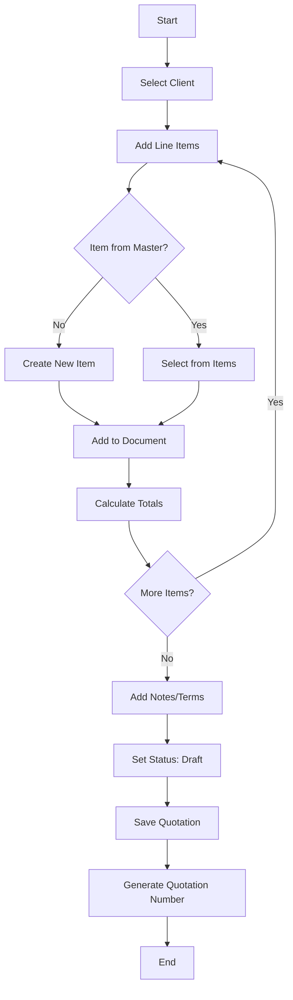
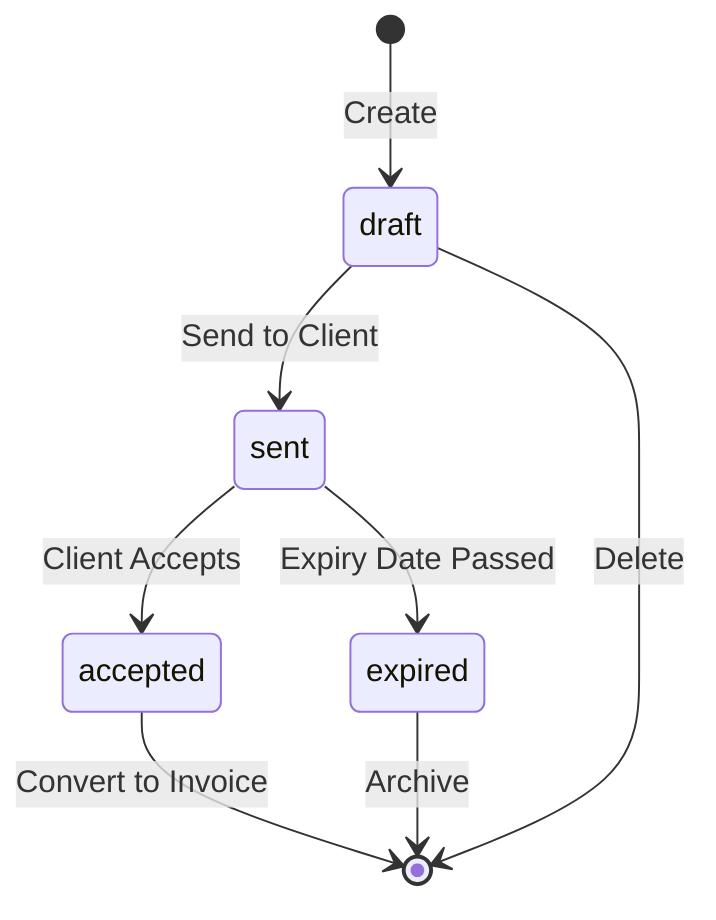
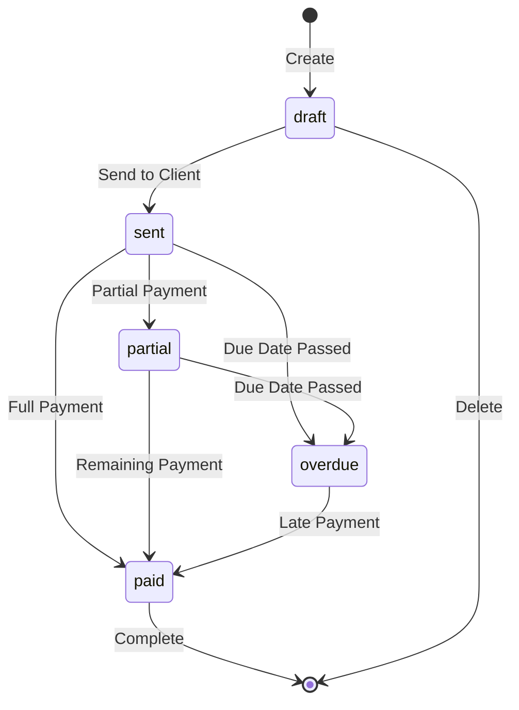
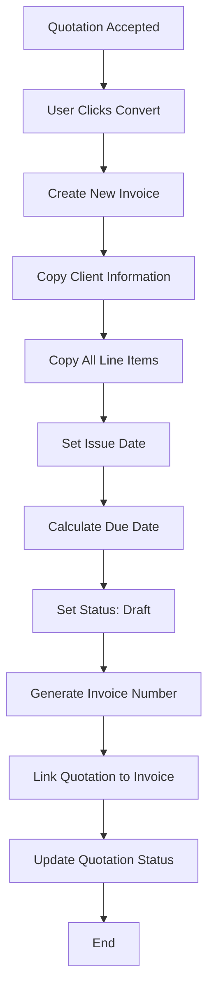
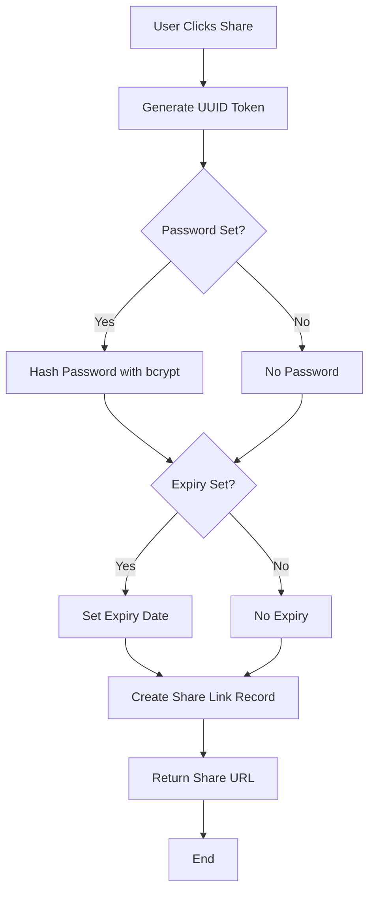
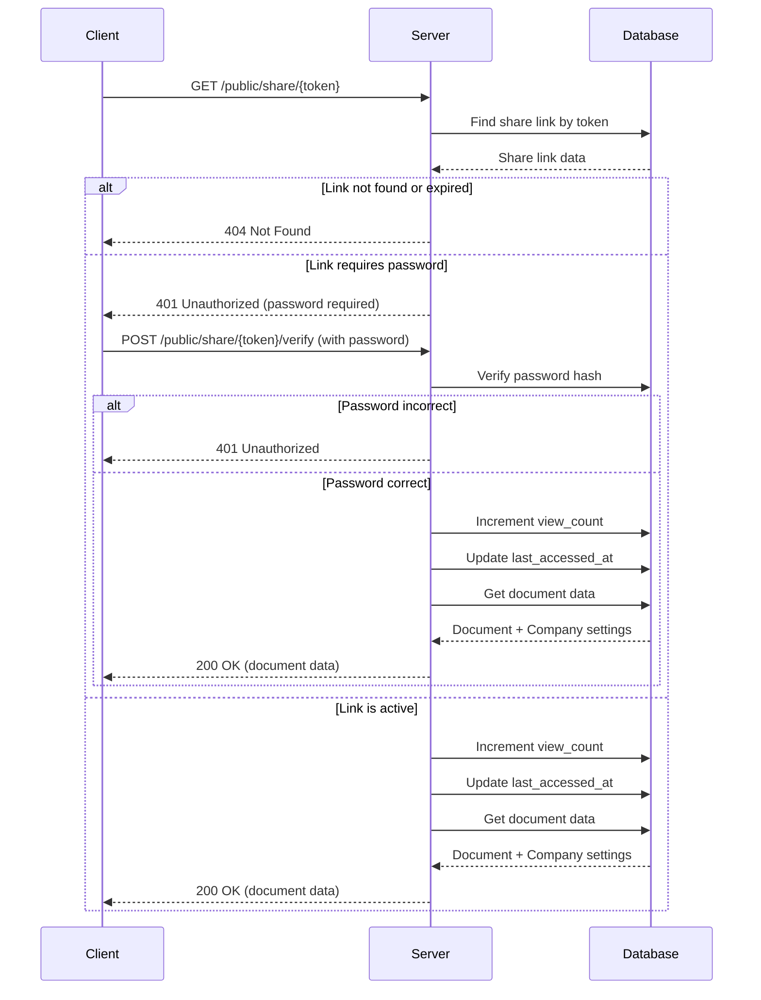
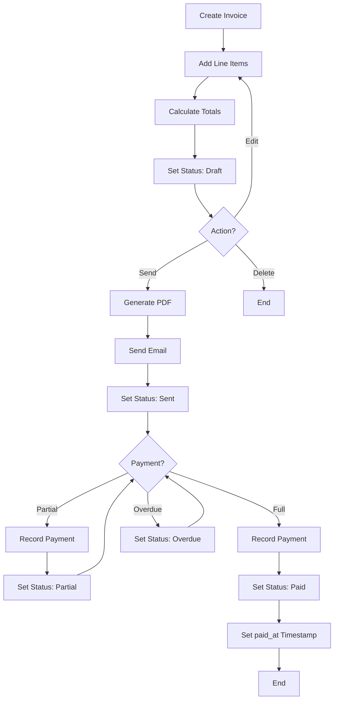
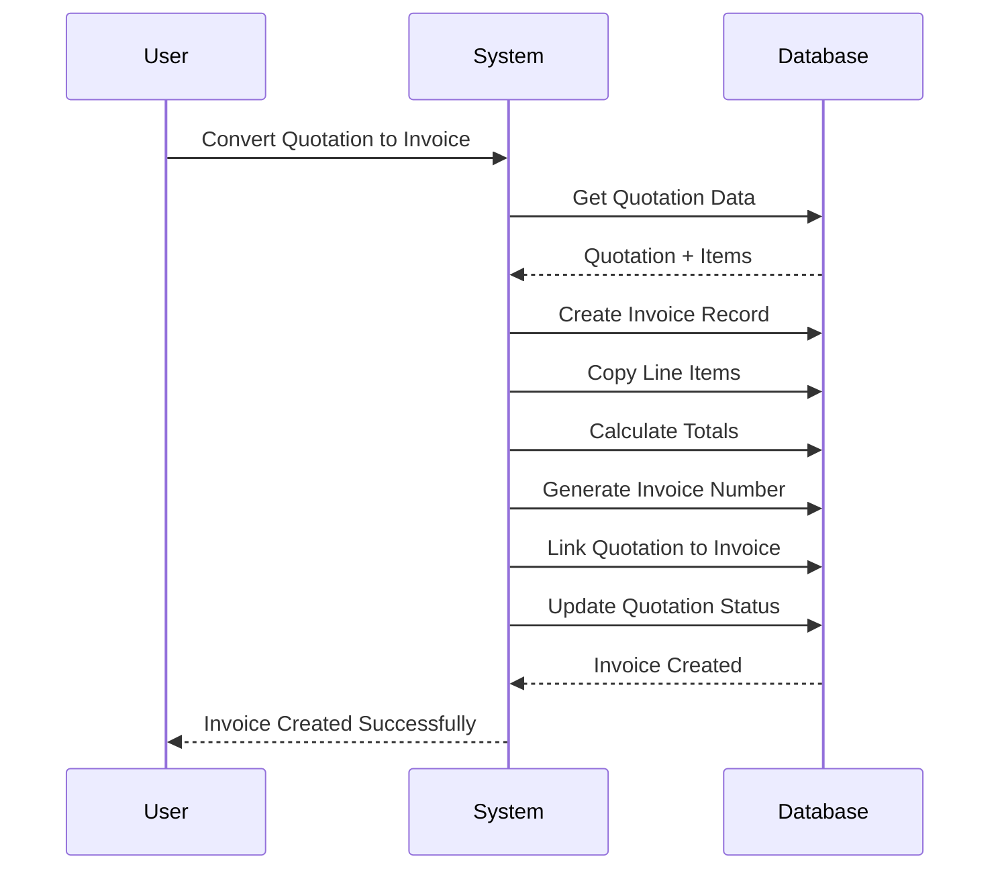

# Application Functionality Documentation

## Overview

This document describes the business logic, workflows, calculations, and feature implementations for the Hisaabu Invoice & Quotation Management application.

---

## Core Features

### 1. User Authentication & Authorization

#### Registration Flow
1. User provides name, email, and password
2. System validates email format and password strength
3. Password is hashed using bcrypt (10 rounds)
4. User account is created with default role 'staff'
5. JWT access token and refresh token are generated
6. User is automatically logged in

#### Login Flow
1. User provides email and password
2. System validates credentials against database
3. If valid, JWT tokens are generated and returned
4. Frontend stores tokens in localStorage/sessionStorage
5. All subsequent API requests include token in Authorization header

#### Password Reset Flow
1. User requests password reset via email
2. System generates secure reset token (expires in 1 hour)
3. Reset link is sent to user's email
4. User clicks link and provides new password
5. System validates token and updates password
6. Token is invalidated

#### Role-Based Access Control
- **Admin**: Full access to all features, can manage users
- **Staff**: Can create/edit invoices and quotations, limited settings access

---

### 2. Client Management

#### Client Creation
- All fields are optional except `name` and `email`
- Email must be unique per user
- Status defaults to 'active'
- System tracks creation timestamp

#### Client Status Management
- **active**: Normal client, can receive invoices/quotations
- **inactive**: Client is archived but records remain
- **new**: Recently added client (first 30 days)
- **overdue**: Client has overdue invoices

#### Client Financial Summary
Calculated fields:
- `totalBilled`: Sum of all invoice `total_amount` for this client
- `totalPaid`: Sum of all invoice `amount_paid` for this client
- `outstanding`: `totalBilled` - `totalPaid`
- `totalInvoices`: Count of invoices
- `totalQuotations`: Count of quotations

Status is automatically updated based on outstanding balance and invoice due dates.

---

### 3. Item & Category Management

#### Category Management
- Each category has a unique color (hex code)
- `itemCount` is automatically maintained via database trigger
- Categories can be deleted; items in that category have `categoryId` set to NULL

#### Item Management
- Items belong to a category (optional)
- Rate is stored as decimal (unit price per piece)
- Status: 'active' or 'inactive'
- Items can be searched by name, description, or category

#### Item Selection in Documents
When adding items to quotations/invoices:
1. User searches existing items
2. If item found, it's added with current rate
3. If not found, user can create new item on-the-fly
4. New item is saved to items master and added to document
5. Item details are "snapshot" in document line items (preserves historical data)

---

### 4. Quotation Management

#### Quotation Creation Workflow



#### Quotation Numbering
Format: `{quotationPrefix}-{YYYY}-{NNN}`
- Example: `QT-2024-001`
- Prefix is configurable in settings
- Number is auto-incremented per user
- Must be unique per user

#### Quotation Status Workflow



**Status Definitions:**
- **draft**: Created but not sent to client
- **sent**: Emailed to client, awaiting response
- **accepted**: Client has accepted the quotation
- **expired**: Expiry date has passed without acceptance

#### Quotation Calculations

**Line Item Total:**
```
lineTotal = (quantity × price × (1 - discountPercent/100)) × (1 + taxPercent/100)
```

**Document Totals:**
```
subtotal = Σ(quantity × price) for all items
discountTotal = Σ(quantity × price × discountPercent/100) for all items
taxTotal = Σ((quantity × price × (1 - discountPercent/100)) × taxPercent/100) for all items
totalAmount = subtotal - discountTotal + taxTotal
```

**Example Calculation:**
- Item: 5 pieces × $120/piece, 5% discount, 10% tax
- Subtotal: 5 × 120 = $600
- Discount: 600 × 0.05 = $30
- After Discount: 600 - 30 = $570
- Tax: 570 × 0.10 = $57
- Line Total: 570 + 57 = $627

---

### 5. Invoice Management

#### Invoice Creation Workflow

Similar to quotation workflow, with additional steps:
1. Set due date (defaults to issue date + payment terms days from settings)
2. Payment status tracking
3. Payment recording

#### Invoice Numbering
Format: `{invoicePrefix}-{NNNN}`
- Example: `INV-0023`
- Prefix is configurable in settings
- Number is auto-incremented per user
- Must be unique per user

#### Invoice Status Workflow



**Status Definitions:**
- **draft**: Created but not sent to client
- **sent**: Emailed to client, awaiting payment
- **partial**: Partially paid (amountPaid > 0 and < totalAmount)
- **paid**: Fully paid (amountPaid >= totalAmount)
- **overdue**: Due date passed and balanceDue > 0

**Status Calculation Logic:**
```javascript
if (amountPaid >= totalAmount) {
  status = 'paid'
} else if (amountPaid > 0) {
  status = 'partial'
} else if (dueDate < today && balanceDue > 0) {
  status = 'overdue'
} else if (status was 'draft' and sent) {
  status = 'sent'
}
```

#### Invoice Calculations

Same as quotation calculations, plus:
```
amountPaid = Σ(payment.amount) for all payments
balanceDue = totalAmount - amountPaid
```

#### Payment Recording

When a payment is recorded:
1. Payment record is created
2. Invoice `amountPaid` is recalculated (sum of all payments)
3. Invoice `balanceDue` is recalculated
4. Invoice status is automatically updated
5. If fully paid, `paidAt` timestamp is set

**Payment Methods:**
- cash
- bank_transfer
- credit_card
- check
- other

---

### 6. Quotation to Invoice Conversion

#### Conversion Workflow



#### Conversion Rules
1. All line items are copied (snapshot preserved)
2. Client information is copied
3. Notes and terms are copied
4. Issue date is set to conversion date (or user-specified)
5. Due date is calculated: issue date + payment terms days
6. Totals are recalculated
7. Quotation status can be updated to 'converted' (optional)
8. Original quotation remains in system for reference

---

### 7. Document Totals Calculation

#### Automatic Calculation Triggers
- When line item is added
- When line item is updated (quantity, price, discount, tax)
- When line item is deleted
- When document is saved

#### Calculation Formula

**For each line item:**
```
itemSubtotal = quantity × price
itemDiscount = itemSubtotal × (discountPercent / 100)
itemAfterDiscount = itemSubtotal - itemDiscount
itemTax = itemAfterDiscount × (taxPercent / 100)
lineTotal = itemAfterDiscount + itemTax
```

**For document:**
```
documentSubtotal = Σ(itemSubtotal) for all items
documentDiscountTotal = Σ(itemDiscount) for all items
documentTaxTotal = Σ(itemTax) for all items
documentTotal = documentSubtotal - documentDiscountTotal + documentTaxTotal
```

**Example:**
```
Item 1: 5 × $120 = $600, 5% discount, 10% tax
  Subtotal: $600
  Discount: $30
  After Discount: $570
  Tax: $57
  Line Total: $627

Item 2: 3 × $150 = $450, 0% discount, 10% tax
  Subtotal: $450
  Discount: $0
  After Discount: $450
  Tax: $45
  Line Total: $495

Document Totals:
  Subtotal: $600 + $450 = $1,050
  Discount Total: $30 + $0 = $30
  Tax Total: $57 + $45 = $102
  Grand Total: $1,050 - $30 + $102 = $1,122
```

---

### 8. Secure Share Links

#### Share Link Generation



#### Share Link Format
```
https://app.hisaabu.com/share/{documentType}/{token}
```

Example: `https://app.hisaabu.com/share/invoice/550e8400-e29b-41d4-a716-446655440000`

#### Share Link Access Flow



#### Share Link Security
- Token is cryptographically secure (UUID v4)
- Password is optional but recommended
- Password is hashed with bcrypt (10 rounds)
- Expiry date is optional
- Links can be deactivated without deletion
- View count is tracked for analytics
- Last accessed timestamp is recorded

---

### 9. PDF Generation

#### PDF Content Structure

1. **Header Section**
   - Company logo (if available)
   - Company name and address
   - Contact information (email, phone)
   - GST/Registration number

2. **Document Header**
   - Document type (INVOICE or QUOTATION)
   - Document number
   - Status badge
   - Issue date
   - Due date (for invoices) or Expiry date (for quotations)

3. **Client Information**
   - Client name
   - Client address
   - Client email/phone

4. **Line Items Table**
   - Description
   - Quantity
   - Rate
   - Tax %
   - Amount (line total)

5. **Totals Section**
   - Subtotal
   - Discount (if any)
   - Tax
   - Grand Total

6. **Notes & Terms**
   - Additional notes
   - Terms and conditions

7. **Footer**
   - Thank you message
   - Company contact information

#### PDF Generation Process
1. Fetch document data from database
2. Fetch company settings for branding
3. Generate HTML template with document data
4. Convert HTML to PDF using library (pdfkit, puppeteer, etc.)
5. Apply company branding (logo, colors)
6. Return PDF as binary response

---

### 10. Email Sending

#### Email Templates

**Quotation Email:**
- Subject: "Quotation #{number} from {companyName}"
- Body: Custom message + quotation details
- Attachment: PDF quotation

**Invoice Email:**
- Subject: "Invoice #{number} from {companyName}"
- Body: Custom message + invoice details + payment instructions
- Attachment: PDF invoice

#### Email Sending Flow
1. User clicks "Send" on quotation/invoice
2. System generates PDF
3. System sends email via email service (SendGrid, Mailgun, etc.)
4. Email log is recorded (optional)
5. Document status is updated to 'sent'

---

### 11. Dashboard Statistics

#### Statistics Calculation

```javascript
dashboardStats = {
  totalQuotations: COUNT(quotations WHERE user_id = current_user),
  totalInvoices: COUNT(invoices WHERE user_id = current_user),
  totalOutstanding: SUM(invoices.balance_due WHERE user_id = current_user),
  paidInvoices: COUNT(invoices WHERE user_id = current_user AND status = 'paid'),
  unpaidInvoices: COUNT(invoices WHERE user_id = current_user AND status IN ('sent', 'draft')),
  overdueInvoices: COUNT(invoices WHERE user_id = current_user AND status = 'overdue')
}
```

#### Recent Activity
- Payment received
- Invoice sent
- Quotation sent
- Quotation viewed (via share link)
- New client added
- Invoice paid

Activities are sorted by timestamp (most recent first), limited to last 10-20 items.

---

### 12. Search & Filtering

#### Search Implementation
- Full-text search on relevant fields:
  - Clients: name, email, phone, address
  - Items: name, description
  - Quotations: number, client name
  - Invoices: number, client name
- Case-insensitive
- Partial matching (LIKE query or full-text search)

#### Filtering Options
- **Clients**: status (all, active, inactive, new, overdue)
- **Items**: category, status (all, active, inactive)
- **Quotations**: status (all, draft, sent, accepted, expired), client, date range
- **Invoices**: status (all, draft, sent, paid, partial, overdue), client, date range

#### Sorting Options
- Default: created_at DESC (newest first)
- Available fields: name, email, date, amount, status
- Order: ASC or DESC

---

### 13. Company Settings

#### Settings Categories

1. **Company Profile**
   - Company name, logo, addresses
   - Contact information
   - Tax/Registration numbers

2. **Tax & Finance**
   - Default tax rate
   - Currency
   - Tax per item enabled/disabled

3. **Invoice Configuration**
   - Invoice/Quotation prefixes
   - Date format
   - Payment terms (days)
   - Terms & conditions template

#### Settings Application
- Settings are user-specific (one settings record per user)
- Settings are used as defaults when creating documents
- Settings can be overridden per document
- Logo is used in PDF generation and email templates

---

## Validation Rules

### User Registration
- Email: Valid email format, unique
- Password: Minimum 8 characters, must include uppercase, lowercase, number, special character
- Name: Required, 2-255 characters

### Client
- Name: Required, 1-255 characters
- Email: Required, valid email format, unique per user
- Phone: Optional, valid phone format
- Status: Must be one of: 'active', 'inactive', 'new', 'overdue'

### Item
- Name: Required, 1-255 characters
- Rate: Required, >= 0, max 2 decimal places
- Category: Optional, must exist if provided
- Status: Must be 'active' or 'inactive'

### Quotation
- Client: Required, must exist
- Issue Date: Required, valid date
- Expiry Date: Required, valid date, must be >= issue date
- Line Items: At least one item required
- Status: Must be one of: 'draft', 'sent', 'accepted', 'expired'

### Invoice
- Client: Required, must exist
- Issue Date: Required, valid date
- Due Date: Required, valid date, must be >= issue date
- Line Items: At least one item required
- Status: Must be one of: 'draft', 'sent', 'paid', 'partial', 'overdue'

### Payment
- Amount: Required, > 0, <= invoice balance_due
- Payment Date: Required, valid date
- Payment Method: Optional, must be one of valid methods if provided
- Reference Number: Optional, max 100 characters

---

## Business Rules

1. **Document Numbering**: Must be unique per user. Auto-generated based on prefix and sequence.

2. **Line Item Snapshot**: When items are added to documents, their details are "snapshot" in the document_items table. This preserves historical data even if the master item is updated or deleted.

3. **Total Calculations**: All totals are automatically calculated and cannot be manually overridden.

4. **Status Updates**: Document statuses are automatically updated based on business logic (payments, dates, etc.).

5. **Client Deletion**: Clients with associated invoices or quotations cannot be deleted (or require cascade handling).

6. **Payment Validation**: Payment amount cannot exceed invoice balance_due.

7. **Share Link Expiry**: Expired or inactive share links cannot be accessed.

8. **Multi-currency**: Currently supports single currency per user. For multi-currency support, store currency with each amount.

9. **Tax Calculation**: Tax is calculated per line item, then summed. If tax_per_item_enabled is false, use default tax rate for all items.

10. **Due Date Calculation**: Default due date = issue date + payment_terms_days from settings.

---

## Workflow Diagrams

### Complete Invoice Lifecycle



### Quotation to Invoice Conversion



---

## Performance Considerations

1. **Database Indexes**: All foreign keys and frequently queried fields are indexed.

2. **Denormalization**: Category `item_count` is denormalized for performance (maintained via triggers).

3. **Caching**: Consider caching:
   - Company settings (rarely change)
   - Dashboard statistics (update every 5 minutes)
   - User session data

4. **Pagination**: All list endpoints support pagination to limit data transfer.

5. **Lazy Loading**: Document line items and payments are loaded on-demand (not in list views).

6. **PDF Generation**: PDFs can be generated on-demand or pre-generated and cached.

---

## Security Considerations

1. **Password Hashing**: All passwords are hashed with bcrypt (10 rounds minimum).

2. **JWT Tokens**: Tokens are signed with a secret key and have expiration times.

3. **Share Links**: Tokens are cryptographically secure (UUID v4). Passwords are hashed.

4. **Input Validation**: All user input is validated on the server side.

5. **SQL Injection Prevention**: Use parameterized queries or ORM.

6. **XSS Prevention**: Sanitize all user input before displaying.

7. **CSRF Protection**: Use CSRF tokens for state-changing operations.

8. **Rate Limiting**: Implement rate limiting to prevent abuse.

9. **File Upload Validation**: Validate file types, sizes, and scan for malware.

10. **Access Control**: Verify user ownership of resources before allowing access/modification.

---

## Future Enhancements

1. **Recurring Invoices**: Schedule invoices to be generated automatically.

2. **Multi-currency**: Support multiple currencies with exchange rates.

3. **Payment Gateway Integration**: Accept online payments via Stripe, PayPal, etc.

4. **Inventory Management**: Track product inventory for items.

5. **Expense Tracking**: Track business expenses.

6. **Reports & Analytics**: Advanced reporting and analytics dashboards.

7. **Mobile App**: Native mobile applications.

8. **API Webhooks**: Webhook support for external integrations.

9. **Multi-tenant Support**: Support for multiple organizations/tenants.

10. **Document Templates**: Customizable document templates.


