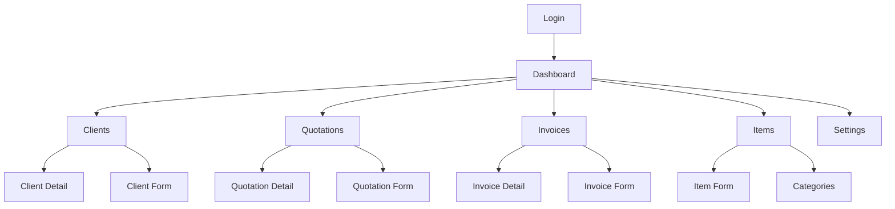
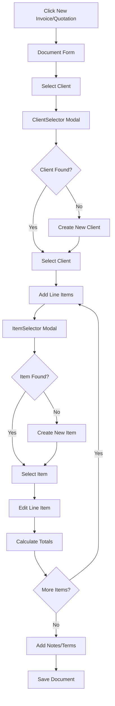

# Screens and Views Documentation

## Overview

This document maps all frontend routes to backend API endpoints, describes screen requirements, data flow, and user interactions for each screen in the Hisaabu application.

---

## Route Mapping

### Frontend Routes → Backend Endpoints

| Frontend Route | Component | Backend Endpoint | Method | Description |
|----------------|-----------|------------------|--------|-------------|
| `/login` | Login | `/auth/login` | POST | User authentication |
| `/signup` | Signup | `/auth/register` | POST | User registration |
| `/` | Dashboard | `/dashboard/stats` | GET | Dashboard statistics |
| `/clients` | ClientsList | `/clients` | GET | List clients |
| `/clients/new` | ClientForm | `/clients` | POST | Create client |
| `/clients/:id` | ClientForm | `/clients/:id` | GET, PUT | Get/Update client |
| `/clients/:id/view` | ClientDetail | `/clients/:id` | GET | Get client details |
| `/items` | ItemsList | `/items` | GET | List items |
| `/items/new` | ItemForm | `/items` | POST | Create item |
| `/items/:id` | ItemForm | `/items/:id` | GET, PUT | Get/Update item |
| `/categories` | CategoriesList | `/categories` | GET | List categories |
| `/categories/new` | CategoryForm | `/categories` | POST | Create category |
| `/categories/:id` | CategoryForm | `/categories/:id` | GET, PUT | Get/Update category |
| `/quotations` | QuotationsList | `/quotations` | GET | List quotations |
| `/quotations/new` | QuotationForm | `/quotations` | POST | Create quotation |
| `/quotations/:id` | QuotationForm | `/quotations/:id` | GET, PUT | Get/Update quotation |
| `/quotations/:id/view` | QuotationDetail | `/quotations/:id` | GET | Get quotation details |
| `/quotations/:id/convert` | - | `/quotations/:id/convert` | POST | Convert to invoice |
| `/invoices` | InvoicesList | `/invoices` | GET | List invoices |
| `/invoices/new` | InvoiceForm | `/invoices` | POST | Create invoice |
| `/invoices/:id` | InvoiceForm | `/invoices/:id` | GET, PUT | Get/Update invoice |
| `/invoices/:id/view` | InvoiceDetail | `/invoices/:id` | GET | Get invoice details |
| `/invoices/:id/payments` | - | `/invoices/:id/payments` | POST | Record payment |
| `/settings` | Settings | `/settings` | GET, PUT | Get/Update settings |
| `/share/:type/:id` | SecureShare | `/public/share/:token` | GET | Public share view |

---

## Screen-by-Screen Documentation

### 1. Login Screen (`/login`)

**File**: `src/pages/Login.jsx`

**Purpose**: User authentication

**UI Components:**
- Email input field
- Password input field (with show/hide toggle)
- "Forgot Password" link
- Login button
- Signup link
- Optional: 2FA/OTP input (if enabled)

**User Interactions:**
1. User enters email and password
2. User clicks "Login" button
3. Frontend validates input (client-side)
4. Frontend calls `POST /auth/login`
5. Backend validates credentials
6. Backend returns JWT token and user data
7. Frontend stores token in localStorage
8. Frontend redirects to Dashboard

**Backend Calls:**
- `POST /auth/login` - Authenticate user

**Data Flow:**
```
User Input → Validation → API Call → Token Storage → Redirect
```

**Error Handling:**
- Display error message for invalid credentials
- Display validation errors for empty fields

---

### 2. Signup Screen (`/signup`)

**File**: `src/pages/Signup.jsx`

**Purpose**: User registration

**UI Components:**
- Name input field
- Email input field
- Password input field (with show/hide toggle)
- Confirm Password input field
- Signup button
- Login link

**User Interactions:**
1. User enters name, email, password, confirm password
2. User clicks "Signup" button
3. Frontend validates input (password match, strength)
4. Frontend calls `POST /auth/register`
5. Backend creates user account
6. Backend returns JWT token and user data
7. Frontend stores token in localStorage
8. Frontend redirects to Dashboard

**Backend Calls:**
- `POST /auth/register` - Register new user

**Data Flow:**
```
User Input → Validation → API Call → Token Storage → Redirect
```

**Error Handling:**
- Display error if email already exists
- Display validation errors for invalid input

---

### 3. Dashboard (`/`)

**File**: `src/pages/Dashboard.jsx`

**Purpose**: Display key metrics and recent activity

**UI Components:**
- Stats cards:
  - Total Outstanding Amount
  - Total Quotations
  - Total Invoices
  - Paid/Unpaid/Overdue breakdown
- Recent Activity list
- Quick Actions:
  - Create Invoice button
  - Create Quotation button

**User Interactions:**
1. Page loads
2. Frontend calls `GET /dashboard/stats`
3. Backend returns statistics
4. Frontend displays stats cards and recent activity
5. User clicks "New Invoice" → Navigate to `/invoices/new`
6. User clicks "New Quote" → Navigate to `/quotations/new`

**Backend Calls:**
- `GET /dashboard/stats` - Get dashboard statistics

**Data Requirements:**
```json
{
  "totalQuotations": 25,
  "totalInvoices": 45,
  "totalOutstanding": 12450.00,
  "paidInvoices": 30,
  "unpaidInvoices": 10,
  "overdueInvoices": 5,
  "recentActivity": [...]
}
```

**Data Flow:**
```
Page Load → API Call → Display Stats → User Actions → Navigation
```

---

### 4. Clients List (`/clients`)

**File**: `src/pages/Clients.jsx`

**Purpose**: Display list of clients with search and filter

**UI Components:**
- Search bar
- Filter chips (All, Active, Overdue, New)
- Desktop: Table view with columns (Client, Email, Phone, Location, Total Billed, Status, Actions)
- Mobile: Card view with client details
- "New Client" button (FAB on mobile)

**User Interactions:**
1. Page loads
2. Frontend calls `GET /clients?page=1&limit=20`
3. Backend returns clients list
4. Frontend displays clients
5. User types in search → Filter clients client-side or call API with search param
6. User clicks filter chip → Filter clients by status
7. User clicks client card/row → Navigate to `/clients/:id/view`
8. User clicks "Edit" → Navigate to `/clients/:id`
9. User clicks "New Client" → Navigate to `/clients/new`

**Backend Calls:**
- `GET /clients` - List clients (with pagination, search, filter)

**Query Parameters:**
- `page`: Page number
- `limit`: Items per page
- `search`: Search term
- `status`: Filter by status

**Data Flow:**
```
Page Load → API Call → Display List → Search/Filter → Navigation
```

---

### 5. Client Detail (`/clients/:id/view`)

**File**: `src/pages/ClientDetail.jsx`

**Purpose**: Display detailed client information

**UI Components:**
- Client header with name, email, status
- Contact Information section
- Financial Summary (Total Invoiced, Total Paid, Outstanding)
- Statistics (Total Invoices, Total Quotations)
- Recent Invoices list (last 3)
- Recent Quotations list (last 3)
- Quick Actions:
  - Edit Client
  - Create Invoice
  - Create Quotation
  - Send Email
  - Call Client
  - Delete Client

**User Interactions:**
1. Page loads
2. Frontend calls `GET /clients/:id`
3. Backend returns client details with financial summary
4. Frontend displays client information
5. User clicks "Edit" → Navigate to `/clients/:id`
6. User clicks "Create Invoice" → Navigate to `/invoices/new?clientId=:id`
7. User clicks invoice/quotation → Navigate to detail page

**Backend Calls:**
- `GET /clients/:id` - Get client details

**Data Requirements:**
- Client basic info
- Financial summary (calculated)
- Recent invoices (last 3)
- Recent quotations (last 3)

**Data Flow:**
```
Page Load → API Call → Display Details → User Actions → Navigation
```

---

### 6. Client Form (`/clients/new`, `/clients/:id`)

**File**: `src/pages/ClientForm.jsx`

**Purpose**: Create or edit client

**UI Components:**
- Form fields:
  - Name (required)
  - Email (required)
  - Phone
  - Address, City, Postal Code, Country
  - Company Name
  - Tax ID
  - Status dropdown
  - Notes textarea
- Save button
- Cancel button

**User Interactions:**
1. Page loads
   - If `:id` exists: Call `GET /clients/:id` and populate form
   - If new: Show empty form
2. User fills form fields
3. User clicks "Save"
4. Frontend validates input
5. Frontend calls:
   - `POST /clients` (if new)
   - `PUT /clients/:id` (if editing)
6. Backend saves client
7. Frontend redirects to `/clients/:id/view` or `/clients`

**Backend Calls:**
- `GET /clients/:id` - Get client (for edit)
- `POST /clients` - Create client
- `PUT /clients/:id` - Update client

**Data Flow:**
```
Page Load → Load Data (if edit) → User Input → Validation → API Call → Redirect
```

---

### 7. Items List (`/items`)

**File**: `src/pages/ItemsList.jsx`

**Purpose**: Display list of items with search and category filter

**UI Components:**
- Search bar
- Category filter dropdown
- "Manage Categories" link
- Desktop: Table view
- Mobile: Card view
- "New Item" button (FAB on mobile)

**User Interactions:**
1. Page loads
2. Frontend calls `GET /items` and `GET /categories`
3. Backend returns items and categories
4. Frontend displays items
5. User searches → Filter items
6. User selects category → Filter by category
7. User clicks item → Navigate to `/items/:id`
8. User clicks "New Item" → Navigate to `/items/new`

**Backend Calls:**
- `GET /items` - List items
- `GET /categories` - List categories (for filter)

**Data Flow:**
```
Page Load → API Calls → Display List → Search/Filter → Navigation
```

---

### 8. Item Form (`/items/new`, `/items/:id`)

**File**: `src/pages/ItemForm.jsx`

**Purpose**: Create or edit item

**UI Components:**
- Form fields:
  - Name (required)
  - Description
  - Rate (required)
  - Category dropdown
  - Status dropdown
- Save button
- Cancel button

**User Interactions:**
Similar to Client Form

**Backend Calls:**
- `GET /items/:id` - Get item (for edit)
- `POST /items` - Create item
- `PUT /items/:id` - Update item
- `GET /categories` - List categories (for dropdown)

---

### 9. Categories List (`/categories`)

**File**: `src/pages/CategoriesList.jsx`

**Purpose**: Display list of categories

**UI Components:**
- Search bar
- Desktop: Grid view with category cards
- Mobile: Card view
- "New Category" button (FAB on mobile)

**User Interactions:**
1. Page loads
2. Frontend calls `GET /categories`
3. Backend returns categories
4. Frontend displays categories
5. User clicks category → Navigate to `/categories/:id`
6. User clicks "New Category" → Navigate to `/categories/new`

**Backend Calls:**
- `GET /categories` - List categories

---

### 10. Category Form (`/categories/new`, `/categories/:id`)

**File**: `src/pages/CategoryForm.jsx`

**Purpose**: Create or edit category

**UI Components:**
- Form fields:
  - Name (required)
  - Description
  - Color picker (required)
- Save button
- Cancel button

**User Interactions:**
Similar to Client Form

**Backend Calls:**
- `GET /categories/:id` - Get category (for edit)
- `POST /categories` - Create category
- `PUT /categories/:id` - Update category

---

### 11. Quotations List (`/quotations`)

**File**: `src/pages/QuotationsList.jsx`

**Purpose**: Display list of quotations with search and filter

**UI Components:**
- Search bar
- Filter chips (All, Draft, Sent, Accepted, Expired)
- Desktop: Table view
- Mobile: Card view
- "New Quotation" button (FAB on mobile)

**User Interactions:**
1. Page loads
2. Frontend calls `GET /quotations`
3. Backend returns quotations
4. Frontend displays quotations
5. User searches → Filter quotations
6. User clicks filter → Filter by status
7. User clicks quotation → Navigate to `/quotations/:id/view`
8. User clicks "Edit" → Navigate to `/quotations/:id`
9. User clicks "Convert to Invoice" → Call `POST /quotations/:id/convert`

**Backend Calls:**
- `GET /quotations` - List quotations
- `POST /quotations/:id/convert` - Convert to invoice

**Data Flow:**
```
Page Load → API Call → Display List → User Actions → Navigation/API Call
```

---

### 12. Quotation Form (`/quotations/new`, `/quotations/:id`)

**File**: `src/pages/QuotationForm.jsx`

**Purpose**: Create or edit quotation

**UI Components:**
- Client selector (searchable dropdown)
- Quotation number (auto-generated, read-only)
- Issue date picker
- Expiry date picker
- Line items table:
  - Add Item button (opens ItemSelector)
  - Editable rows (quantity, price, discount, tax)
  - Delete item button
- Totals section (auto-calculated)
- Notes textarea
- Terms textarea
- Status dropdown
- Save button
- Send button
- Print Preview button
- Share Link button

**User Interactions:**
1. Page loads
   - If `:id` exists: Call `GET /quotations/:id` and populate form
   - If new: Show empty form with auto-generated number
2. User selects client (opens ClientSelector modal)
3. User clicks "Add Item" → Opens ItemSelector modal
4. User searches/selects item or creates new → Item added to table
5. User edits line item fields → Totals recalculate
6. User clicks "Save" → Call `POST /quotations` or `PUT /quotations/:id`
7. User clicks "Print Preview" → Opens PrintPreview modal
8. User clicks "Share Link" → Generates share link

**Backend Calls:**
- `GET /quotations/:id` - Get quotation (for edit)
- `GET /clients` - List clients (for selector)
- `GET /items` - List items (for selector)
- `POST /quotations` - Create quotation
- `PUT /quotations/:id` - Update quotation
- `POST /share-links` - Generate share link

**Data Flow:**
```
Page Load → Load Data (if edit) → User Input → Calculations → API Call → Redirect
```

---

### 13. Quotation Detail (`/quotations/:id/view`)

**File**: `src/pages/QuotationDetail.jsx`

**Purpose**: Display quotation details (read-only view)

**UI Components:**
- Quotation header (number, status, dates)
- Client information
- Line items table
- Totals section
- Notes and terms
- Actions:
  - Edit
  - Convert to Invoice
  - Print Preview
  - Share Link
  - Download PDF
  - Send Email
  - Delete

**User Interactions:**
1. Page loads
2. Frontend calls `GET /quotations/:id`
3. Backend returns quotation details
4. Frontend displays quotation
5. User clicks "Edit" → Navigate to `/quotations/:id`
6. User clicks "Convert to Invoice" → Call `POST /quotations/:id/convert` → Navigate to new invoice
7. User clicks "Print Preview" → Opens PrintPreview modal
8. User clicks "Download PDF" → Call `GET /quotations/:id/pdf`

**Backend Calls:**
- `GET /quotations/:id` - Get quotation details
- `POST /quotations/:id/convert` - Convert to invoice
- `GET /quotations/:id/pdf` - Generate PDF

---

### 14. Invoices List (`/invoices`)

**File**: `src/pages/InvoicesList.jsx`

**Purpose**: Display list of invoices with search and filter

**UI Components:**
- Search bar
- Filter chips (All, Draft, Sent, Paid, Partial, Overdue)
- Desktop: Table view
- Mobile: Card view
- "New Invoice" button (FAB on mobile)

**User Interactions:**
Similar to Quotations List

**Backend Calls:**
- `GET /invoices` - List invoices

---

### 15. Invoice Form (`/invoices/new`, `/invoices/:id`)

**File**: `src/pages/InvoiceForm.jsx`

**Purpose**: Create or edit invoice

**UI Components:**
- Similar to Quotation Form, plus:
  - Due date picker (instead of expiry date)
  - Payment status display
  - Record Payment button (if not fully paid)

**User Interactions:**
Similar to Quotation Form, plus:
- User clicks "Record Payment" → Opens payment modal
- User enters payment details → Call `POST /invoices/:id/payments`

**Backend Calls:**
- `GET /invoices/:id` - Get invoice (for edit)
- `POST /invoices` - Create invoice
- `PUT /invoices/:id` - Update invoice
- `POST /invoices/:id/payments` - Record payment

---

### 16. Invoice Detail (`/invoices/:id/view`)

**File**: `src/pages/InvoiceDetail.jsx`

**Purpose**: Display invoice details with payment history

**UI Components:**
- Similar to Quotation Detail, plus:
  - Payment status and balance
  - Payment history table
  - Record Payment button

**User Interactions:**
Similar to Quotation Detail, plus:
- User clicks "Record Payment" → Opens payment modal
- User enters payment → Call `POST /invoices/:id/payments`

**Backend Calls:**
- `GET /invoices/:id` - Get invoice details (includes payments)
- `POST /invoices/:id/payments` - Record payment
- `GET /invoices/:id/pdf` - Generate PDF

---

### 17. Settings (`/settings`)

**File**: `src/pages/Settings.jsx`

**Purpose**: Manage company settings

**UI Components:**
- Tabs:
  - Company Profile
  - Tax & Finance
  - Invoice Configuration
  - Users & Access
- Form fields for each tab
- Save button

**User Interactions:**
1. Page loads
2. Frontend calls `GET /settings`
3. Backend returns settings
4. Frontend displays settings in tabs
5. User edits settings
6. User clicks "Save" → Call `PUT /settings`
7. Backend updates settings
8. Frontend shows success message

**Backend Calls:**
- `GET /settings` - Get settings
- `PUT /settings` - Update settings
- `POST /settings/logo` - Upload logo

---

### 18. Secure Share (`/share/:type/:id`)

**File**: `src/pages/SecureShare.jsx`

**Purpose**: Public view of document via share link (no authentication required)

**UI Components:**
- Password input (if link is password-protected)
- Document preview (similar to detail view, but read-only)
- Download PDF button
- Acknowledge button (optional)

**User Interactions:**
1. User visits share link URL
2. Frontend extracts token from URL
3. Frontend calls `GET /public/share/:token`
4. If password required, show password input
5. User enters password → Call `POST /public/share/:token/verify`
6. Backend validates password
7. Backend returns document data
8. Frontend displays document
9. User clicks "Download PDF" → Call PDF endpoint
10. User clicks "Acknowledge" → Call `POST /public/share/:token/acknowledge`

**Backend Calls:**
- `GET /public/share/:token` - Get document via share link
- `POST /public/share/:token/verify` - Verify password
- `POST /public/share/:token/acknowledge` - Acknowledge document

**Data Flow:**
```
URL Load → Extract Token → API Call → Password Check (if needed) → Display Document
```

---

## Component Data Requirements

### ItemSelector Component

**Purpose**: Search and select items, or create new item on-the-fly

**Data Requirements:**
- `GET /items?search=:term` - Search items
- `POST /items` - Create new item (if not found)

**User Flow:**
1. User opens ItemSelector modal
2. User types search term
3. Frontend calls API with search term
4. Frontend displays matching items
5. User selects item → Item added to document
6. OR: User clicks "Create New Item" → Opens create form → Creates item → Adds to document

---

### ClientSelector Component

**Purpose**: Search and select client, or create new client on-the-fly

**Data Requirements:**
- `GET /clients?search=:term` - Search clients
- `POST /clients` - Create new client (if not found)

**User Flow:**
Similar to ItemSelector

---

### PrintPreview Component

**Purpose**: Display print-friendly document preview

**Data Requirements:**
- Document data (already loaded in parent component)
- Company settings (for branding)

**Features:**
- Print button (triggers browser print)
- Download PDF button (calls PDF endpoint)
- Share Link button (generates share link)

---

## Navigation Flow Diagrams

### Main Navigation Flow



### Document Creation Flow



---

## Data Flow Patterns

### List → Detail → Edit Flow

```
List Page → API Call → Display List
  ↓
Click Item → Navigate to Detail
  ↓
Detail Page → API Call → Display Details
  ↓
Click Edit → Navigate to Form
  ↓
Form Page → Load Data → User Edits → Save → API Call → Redirect
```

### Create Flow

```
Click New → Navigate to Form
  ↓
Form Page → Empty Form → User Fills → Save → API Call → Redirect
```

### Search and Filter Flow

```
User Types Search → Debounce → API Call with Search Param
  ↓
Backend Returns Filtered Results
  ↓
Frontend Updates List Display
```

---

## Error Handling Patterns

### API Error Handling

1. **Network Error**: Display "Connection error. Please try again."
2. **401 Unauthorized**: Clear token, redirect to login
3. **404 Not Found**: Display "Resource not found" message
4. **422 Validation Error**: Display field-specific error messages
5. **500 Server Error**: Display "Server error. Please try again later."

### Form Validation

1. **Client-side**: Validate before API call
2. **Server-side**: Display validation errors from API response
3. **Real-time**: Validate fields on blur/change

---

## Loading States

### List Pages
- Show skeleton loaders while fetching data
- Show "No items found" if list is empty

### Detail Pages
- Show loading spinner while fetching data
- Show error message if data not found

### Forms
- Disable submit button while saving
- Show loading spinner on submit button
- Show success message after save

---

## Notes for Backend Implementation

1. **Pagination**: All list endpoints should support pagination
2. **Search**: Implement full-text search on relevant fields
3. **Filtering**: Support filtering by status, date range, etc.
4. **Sorting**: Support sorting by various fields
5. **Related Data**: Include related data in detail endpoints (client, items, payments)
6. **Computed Fields**: Calculate and return computed fields (totals, outstanding, etc.)
7. **Error Messages**: Return clear, user-friendly error messages
8. **Validation**: Validate all input on server side
9. **CORS**: Configure CORS for frontend domain
10. **Rate Limiting**: Implement rate limiting to prevent abuse


